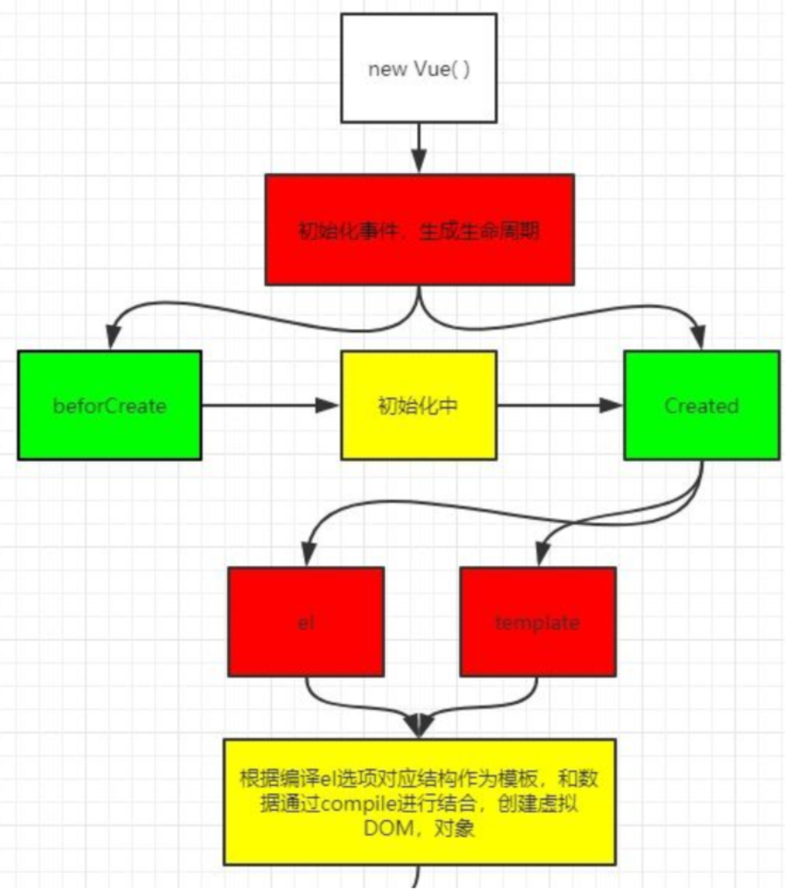
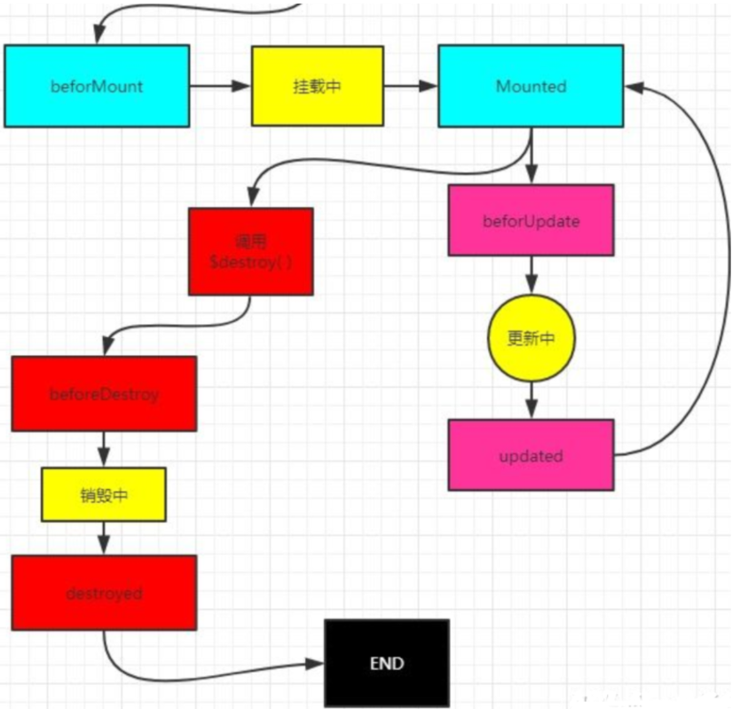

# Vue原理的理解

> 首先声明，这是我自己个人对vue2.0原理的理解，暂时可能没有源码附上，把理解的精华浓缩成几段话，哈哈哈。。。
>
> ​																													--------------参考书籍《深入浅出vue.js》

## 1.vue的响应式原理

主要涉及四个类

- Vue类：创建Vue对象，同时创建Observer类的对象，Observer就是对data数据进行响应式处理的类


- （监听器）Observer类：Observer类中实现对data的监听，是通过`Object.defineProperty()`方法实现的数据劫持，把原来获取对象属性的逻辑改为通过get、set的方式获取，那么就可以在这两个方法中添加自己的逻辑。主要是劫持所有属性，当有变动就通知订阅者。如果需要对所有属性都进行监听的话，需要递归遍历所有属性值，并进行`Object.defineProperty()`处理


- Dep类：他有一个subs的数组，用于保存依赖(也叫依赖搜集)，所谓的依赖就是**哪里**依赖了该数据


- （订阅者）Watcher类：就是上面说的依赖，它做的事情就是观察数据的变更，它会调用data中对应属性的get方法触发依赖收集，并在数据变更后执行相应的函数，进而更新视图。

大概原理：data数据是通过Observer类中的`Object.defineProperty()`方法将属性转换为getter、setter的形式来追踪数据变化，当外界通过Watcher读取数据时，会触发getter方法，从而getter中将Watcher添加到依赖数组Dep中。当数据发生了变化，也就是修改数据的时候，会触发setter方法，从而向Dep中的依赖Watcher发送通知。Watcher接收到通知后，会向外界发送更新通知，触发`update()`方法，变化通知到外界后可能会触发视图更新，也可能会触发用户的某个回调函数。

核心是使用数据劫持和发布订阅模式


## 2.双向数据绑定原理

原理：主要利用数据劫持和事件的发布订阅来实现双向数据绑定，当我们在vue data选项中定义数据时，vue会通过观察者对象（ observer ）将data选项中的所有key，经过Object.defineProperty 的getter 和setter进行设置，当我们通过 v-model指令绑定元素是， 自动触发getter,getter会返回一个初始值，这样我们在视图中就可以看到数据了，当视图中内容改变时，会触发setter,setter会通知vue，视图已经进行了更新，vue会重新生成 虚拟DOM , 继而通过 新旧 虚拟DOM 对比， 生成patch对象，再将patch对应渲染到视图中。

v-model的实现原理：input框里面通过v-bind动态绑定一个value，然后再input框里面通过@input方法去动态获取input输入的值，然后重新给变量赋值。

## 3.diff算法

```js
export default function patch(oldVnode, newVnode) {
    // 判断传入的第一个参数，是DOM节点还是虚拟节点
    if (oldVnode.sel === '' || oldVnode.sel === undefined) {
        // 传入的第一个参数是DOM节点，此时要包装成虚拟节点
        oldVnode = vnode(oldVnode.tagName.toLowerCase(), {}, [], undefined, oldVnode);
    }

    // 判断oldVnode和newVnode是不是同一个节点
    if (oldVnode.key === newVnode.key && oldVnode.sel === newVnode.sel) {
        //是同一个节点，则进行精细化比较
        patchVnode(oldVnode, newVnode);
    }
    else {
        // 不是同一个节点，暴力插入新的，删除旧的
        let newVnodeElm = createElement(newVnode);

        // 将新节点插入到老节点之前
        if (oldVnode.elm.parentNode && newVnodeElm) {
            oldVnode.elm.parentNode.insertBefore(newVnodeElm, oldVnode.elm);
        }
        // 删除老节点
        oldVnode.elm.parentNode.removeChild(oldVnode.elm);
    }
}
```

```js
export default function patchVnode(oldVnode, newVnode) {
    // 判断新旧vnode是否是同一个对象
    if (oldVnode === newVnode) {
        return;
    }
    // 判断vnode有没有text属性
    if (newVnode.text !== undefined && (newVnode.children === undefined || newVnode.children.length === 0)) {
        console.log('新vnode有text属性');
        if (newVnode.text !== oldVnode.text) {
            oldVnode.elm.innerText = newVnode.text;
        }
    }
    else {
        // 新vnode没有text属性，有children
        console.log('新vnode没有text属性');
        // 判断老的有没有children
        if (oldVnode.children !== undefined && oldVnode.children.length > 0) {
            // 老的有children，新的也有children
            updateChildren(oldVnode.elm, oldVnode.children, newVnode.children);
        }
        else {
            // 老的没有children，新的有children
            // 清空老的节点的内容
            oldVnode.elm.innerHTML = '';
            // 遍历新的vnode的子节点，创建DOM，上树
            for (let i = 0; i < newVnode.children.length; i++) {
                let dom = createElement(newVnode.children[i]);
                oldVnode.elm.appendChild(dom);
            }
        }
    }
}
```

```js
export default function updateChildren(parentElm, oldCh, newCh) {
    // 旧前
    let oldStartIdx = 0;
    // 新前
    let newStartIdx = 0;
    // 旧后
    let oldEndIdx = oldCh.length - 1;
    // 新后
    let newEndIdx = newCh.length - 1;
    // 旧前节点
    let oldStartVnode = oldCh[0];
    // 旧后节点
    let oldEndVnode = oldCh[oldEndIdx];
    // 新前节点
    let newStartVnode = newCh[0];
    // 新后节点
    let newEndVnode = newCh[newEndIdx];

    let keyMap = null;

    while (oldStartIdx <= oldEndIdx && newStartIdx <= newEndIdx) {
        // 略过已经加undefined标记的内容
        if (oldStartVnode == null || oldCh[oldStartIdx] === undefined) {
            oldStartVnode = oldCh[++oldStartIdx];
        }
        else if (oldEndVnode == null || oldCh[oldEndIdx] === undefined) {
            oldEndVnode = oldCh[--oldEndIdx];
        }
        else if (newStartVnode == null || newCh[newStartIdx] === undefined) {
            newStartVnode = newCh[++newStartIdx];
        }
        else if (newEndVnode == null || newCh[newEndIdx] === undefined) {
            newEndVnode = newCh[--newEndIdx];
        }
        else if (checkSameVnode(oldStartVnode, newStartVnode)) {
            // 新前与旧前
            console.log('新前与旧前命中');
            patchVnode(oldStartVnode, newStartVnode);
            oldStartVnode = oldCh[++oldStartIdx];
            newStartVnode = newCh[++newStartIdx];
        }
        else if (checkSameVnode(oldEndVnode, newEndVnode)) {
            // 新后和旧后
            console.log('新后和旧后命中');
            patchVnode(oldEndVnode, newEndVnode);
            oldEndVnode = oldCh[--oldEndIdx];
            newEndVnode = newCh[--newEndVnode];
        }
        else if (checkSameVnode(oldStartVnode, newEndVnode)) {
            console.log('新后和旧前命中');
            patchVnode(oldStartVnode, newEndVnode);
            // 当新后与旧前命中的时候，此时要移动节点，移动新后指向的这个节点到老节点旧后的后面
            parentElm.insertBefore(oldStartVnode.elm, oldEndVnode.elm.nextSibling);
            oldStartVnode = oldCh[++oldStartIdx];
            newEndVnode = newCh[--newEndIdx];
        }
        else if (checkSameVnode(oldEndVnode, newStartVnode)) {
            // 新前和旧后
            console.log('新前和旧后命中');
            patchVnode(oldEndVnode, newStartVnode);
            // 当新前和旧后命中的时候，此时要移动节点，移动新前指向的这个节点到老节点旧前的前面
            parentElm.insertBefore(oldEndVnode.elm, oldStartVnode.elm);
            oldEndVnode = oldCh[--oldEndIdx];
            newStartVnode = newCh[++newStartIdx];
        }
        else {
            // 四种都没有命中
            // 制作keyMap一个映射对象，这样就不用每次都遍历老对象了
            if (!keyMap) {
                keyMap = {};
                for (let i = oldStartIdx; i <= oldEndIdx; i++) {
                    const key = oldCh[i].key;
                    if (key !== undefined) {
                        keyMap[key] = i;
                    }
                }
            }
            // 寻找当前这项（newStartIdx）在keyMap中的映射的位置序号
            const idxInOld = keyMap[newStartVnode.key];
            if (idxInOld === undefined) {
                // 如果idxInOld是undefined表示踏实全新的项，此时会将该项创建为DOM节点并插入到旧前之前
                parentElm.insertBefore(createElement(newStartVnode), oldStartVnode.elm);
            }
            else {
                // 如果不是undefined，则不是全新的项，则需要移动
                const elmToMove = oldCh[idxInOld];
                patchVnode(elmToMove, newStartVnode);
                // 把这项设置为undefined，表示已经处理完这项了
                oldCh[idxInOld] = undefined;
                // 移动
                parentElm.insertBefore(elmToMove.elm, oldStartVnode.elm);
            }
            // 指针下移，只移动新的头
            newStartVnode = newCh[++newStartIdx];
        }
    }

    // 循环结束后，处理未处理的项
    if (newStartIdx <= newEndIdx) {
        console.log('new还有剩余节点没有处理，要加项，把所有剩余的节点插入到oldStartIdx之前');
        // 遍历新的newCh，添加到老的没有处理的之前
        for (let i = newStartIdx; i <= newEndIdx; i++) {
            // insertBefore方法可以自动识别null，如果是null就会自动排到队尾去
            // newCh[i]现在还没有真正的DOM，所以要调用createElement函数变为DOM
            parentElm.insertBefore(createElement(newCh[i]), oldCh[oldStartIdx].elm);
        }
    }
    else if (oldStartIdx <= oldEndIdx) {
        console.log('old还有剩余节点没有处理，要删除项');
        // 批量删除oldStart和oldEnd指针之间的项
        for (let i = oldStartIdx; i <= oldEndIdx; i++) {
            if (oldCh[i]) {
                parentElm.removeChild(oldCh[i].elm);
            }
        }
    }
}
```

## 3.vue的生命周期

vue的生命周期分为四个阶段：初始化阶段，模板编译阶段，挂载阶段，卸载阶段。

**vue生命周期生成到编译环境的选项 如下图：**



在将生命周期前，我们先知道，生命周期的钩子函数是什么?

那就是在整个生命周期中，主动执行的函数，称为钩子函数

1.在new Vue实例化后会自动执行初始化函数，会初始化事件，生成vue实例的整个生命周期，这个时候就有整个生命周期

2.执行初始化前**beforeCreate** 这个生命周期的钩子函数无法进行如何的操作，在当前阶段data、methods、computed以及watch上的数据和方法都不能被访问。可以理解为只是走一个流程

3.进入到初始化中，这个时候会初始化data和props，并且给数据绑定上对象劫持（vue的核心）不知道对象劫持的同学可以去搜索一下，必须先弄懂这个东西

4.初始化结束**created** 这个时候，我们可以通过它获取到data数据了，并且可以得到一个“假”的HTML，但不会在页面展示，当前阶段已经完成了数据观测，也就是可以使用数据，更改数据，在这里更改数据不会触发updated函数。可以做一些初始数据的获取，在当前阶段无法与Dom进行交互，如果非要想，可以通过vm.$nextTick来访问Dom

5.来到编译环境的选项，是否有**el**或**template**，根据编译选项作为模板并且将数据和compile函数（编译函数）进行结合，创建出虚拟DOM，对象。

**从生命周期的生成到编译环境的选项，我们基本了解完了上半部分**

**接下来，我们了解数据如何在页面的流程，下半部分的内容，如下图：**



在编译环境到生成虚拟DOM后，就会来到数据挂载的生命周期钩子函数。

6.数据挂载前 **beforeMount** 在这个钩子函数中，我们可以获取到数据，也就是响应式数据发生更新，虚拟dom重新渲染之前被触发，你可以在当前阶段进行更改数据，不会造成重渲染。

7.挂载中，会生成**$el**(自行查解)，并且替换掉原有的编译模板，生成一个真正可用的HTML

8.数据挂载后 **mounted** 将HTML显示到页面，在当前阶段，真实的Dom挂载完毕，数据完成双向绑定，可以访问到Dom节点，使用$refs属性对Dom进行操作。

**在mounted下，会有2个生命周期钩子函数，那就是数据更新阶段的钩子函数**

9.**beforeUpdate** 页面数据更新之前，监听数据的改变，并且可以获取到**最新**的数据，但是不会更新页面的数据

10.更新中 将最新的数据重新渲染更新DOM，并且执行compile 和打补丁（只改变数据影响的内容，其他不会改变）

11.**updated**数据更新完毕 在这个生命周期钩子函数中 我们可以获取到当前**最新**的数据（也就是页面中的最新数据）当前阶段组件Dom已完成更新。要注意的是避免在此期间更改数据，因为这可能会导致无限循环的更新

**销毁阶段的生命周期钩子函数**

1.在触发**$destroy( )**函数后，就会触发销毁阶段

2.**beforeDestroy** 销毁之前 还是可以使用HTML的，在当前阶段实例完全可以被使用，我们可以在这时进行善后收尾工作，比如清除计时器，销毁父组件对子组件的重复监听。beforeDestroy(){Bus.$off("saveTheme")}

3.销毁中 终止对象劫持（最主要）子组件，事件

4.**destroyed** 销毁之后 组件已被拆解，数据绑定被卸除，监听被移出，子实例也统统被销毁。

vue的整个生命周期过程执行完毕，我们会发现两个问题？

第一个问题 除了**beforeCreated**无法获取到数据之外，其他钩子函数都可以获取到数据

而仅仅只有 **beforeUpdate**和**updated**获取到的是最新的数据

第二个问题 **beforeUpdate**和**updated** 会在数据不断发生改变时重复触发（从而实现数据影响视图）

## 4.nextTick原理与场景

概念：nextTick接收一个回调函数作为参数，等vue完成DOM更新之后再执行回调函数。

原理：vue是异步执行DOM更新的，数据发生变化时，vue会开启一个队列，然后把同一个事件循环当中观察到的数据变化对应的watcher依赖推送进这个队列，如果这个watcher被多次触发，则只会被推送到队列一次，主要时为了去重，减少不必要的计算和DOM操作，在下一次循环中，vue会让队列中的watcher触发渲染流程并清空队列。

## 5.v-if和v-show的区别

199398v-if条件判断，v-show是条件隐藏，两者皆表示显示或者隐藏DOM元素，但是`v-if`是对DOM节点的创建和销毁来进行切换的，每切换一次都要重新走一次生命周期【`v-if`由false变为true的时候，触发组件的`beforeCreate`、`create`、`beforeMount`、`mounted`钩子，由true变为false时触发组件的`beforeDestory`、`destoryed`方法。】，切换性能开销大；`v-show`本质是修改css属性`display`。显示隐藏的时候，前者元素不在DOM树中也不在渲染树中，后者还在DOM树中，但也不在渲染树中

## 6.vue组件间通信

vue组件间通信的几种方式：如`props`/`$emit`、`$emit`/`$on`、vuex、`$parent` / `$children`、`$attrs`/`$listeners`和`provide`/`inject`

### 6.1父子间通信[props/$emit]

**6.1.1父组件向子组件传值**

父组件通过props向下传递数据给子组件。注：组件中的数据共有三种形式：data、props、computed

```js
  props:{
    users:{           //这个就是父组件中子标签自定义名字
      type:Array,
      required:true
    }
  }
```

**6.1.2子组件向父组件传值（通过事件形式）**

子组件通过绑定事件，触发父组件事件，从而给父组件发送数据

### 6.2事件总线$emit/$on

### 6.3vuex

### 7.scoped的原理

7.1简单的理解

- 给HTML上的DOM节点加一个唯一的[data-v-hash]属性
- 在每个css选择器的末尾加一个当前组件的data-v-hash属性选择器来实现私有化

7.2原理

1. 通过VueLoaderPlugin来处理webpack的rule规则，得到匹配文件。
2. 接着由vue-loader来处理，通过parse方法将.vue文件按照template、script、style分割代块，此时会根据文件路径和文件内容生产一个hash值，并赋值给id.
3. 对于style代码块，vue-loader会在css-loader前增加stylePostLoader，stylePostLoader会给每个选择器增加属性[data-v-hash]，hash值就是id值
4. 对于template的render块，vue-loader会判断vue文件中是否有scoped的style，有则返回属性[data-v-hash]，在虚拟DOM渲染成真实DOM的时候，会给DOM元素添加该属性值。

7.3缺点

CSS权重增加，因为权重是会累加的